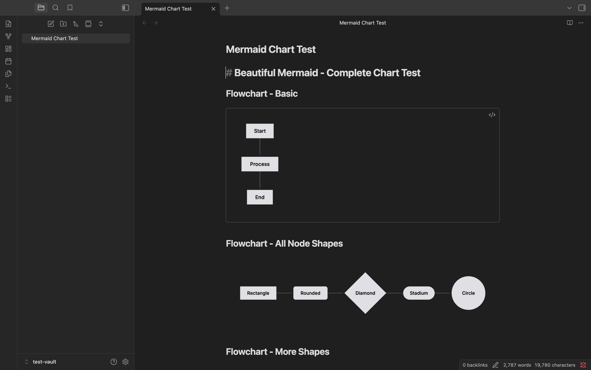

## Beautiful Mermaid

Renders beautiful mermaid diagrams in [Obsidian](https://obsidian.md) using [beautiful-mermaid](https://github.com/nicolo-ribaudo/beautiful-mermaid) for clean, theme-aware styling.

- Replaces the default mermaid renderer with beautiful-mermaid for nicer diagrams.
- Automatically adapts to light and dark themes.
- Supports all mermaid diagram types: flowcharts, sequence diagrams, class diagrams, ER diagrams, state diagrams, XY charts, and more.
- Includes a toggle button to view the raw mermaid source code.
- Works in both Reading and Live Preview modes.

## Installation

### Install via BRAT

1. Install the [BRAT plugin](obsidian://show-plugin?id=obsidian42-brat) under Community Plugins.
2. Open BRAT settings and click "Add beta plugin".
3. Enter the URL of this repository: `https://github.com/edrickleong/obsidian-beautiful-mermaid`.
4. Under "Select a version", choose the Latest version.
5. Click "Add plugin".

### Install via Community Plugins

Beautiful Mermaid is not yet available under Community Plugins.

## Credits

This plugin uses [beautiful-mermaid](https://github.com/nicolo-ribaudo/beautiful-mermaid).

## License

This project is licensed under the MIT License.
