# Beautiful Mermaid - Complete Chart Test

## Flowchart - Basic

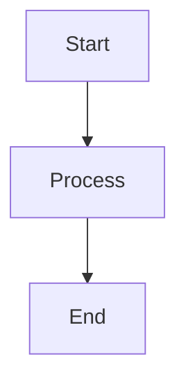

## Flowchart - All Node Shapes

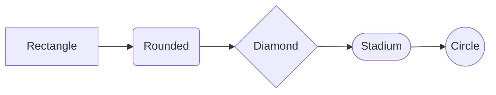

## Flowchart - More Shapes

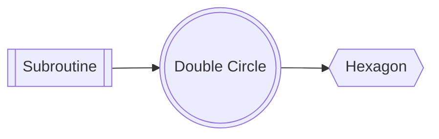

## Flowchart - Special Shapes

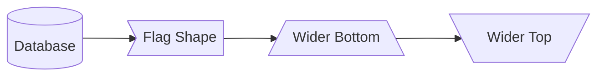

## Flowchart - All Shapes Combined

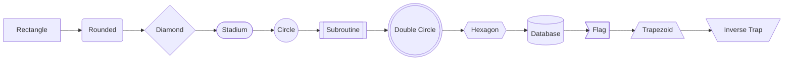

## Flowchart - Link Styles

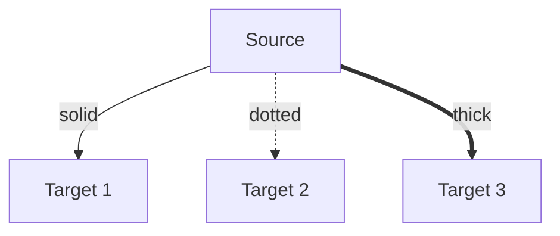

## Flowchart - Linkless Connections

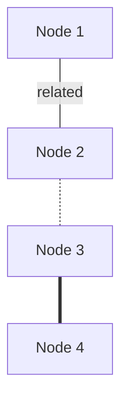

## Flowchart - Decision

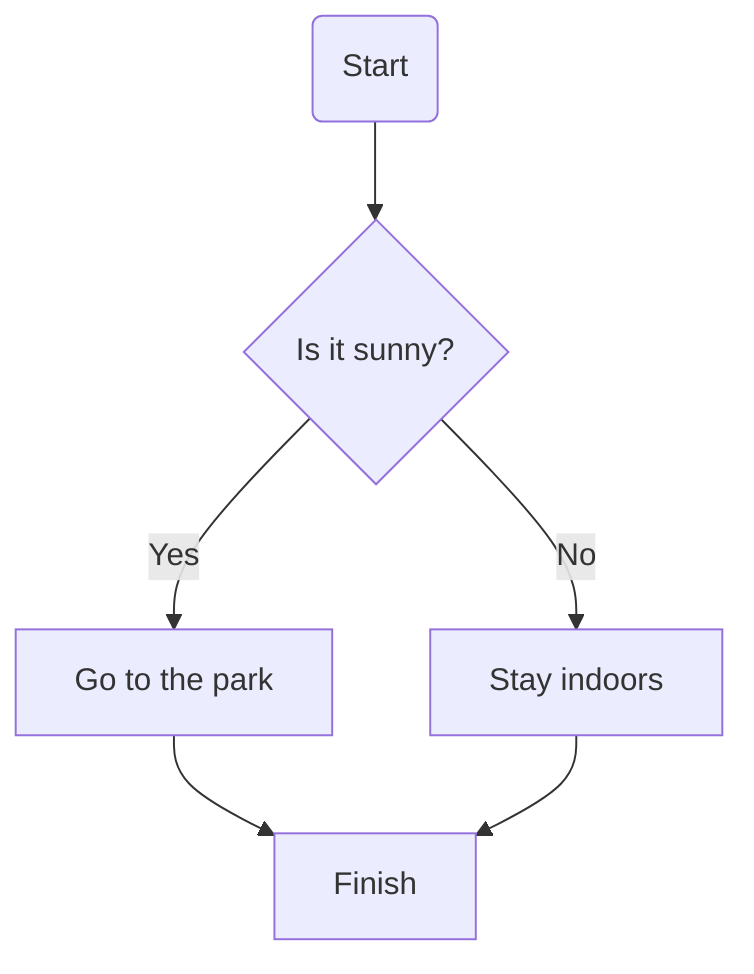

## Flowchart - Bidirectional

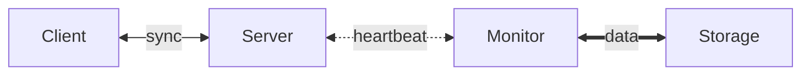

## Flowchart - Multi-source

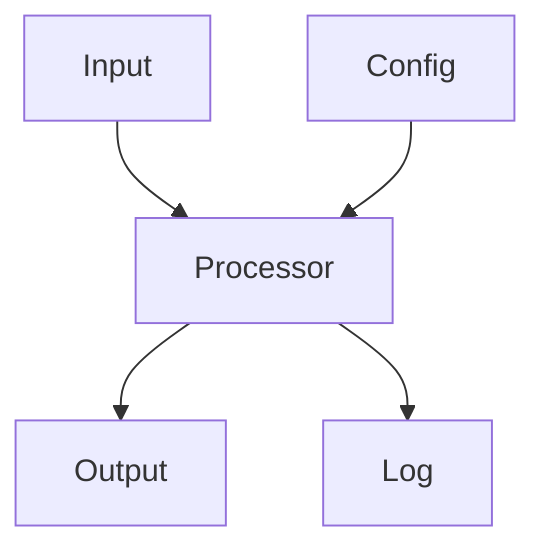

## Flowchart - Chain

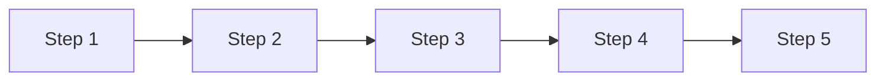

## Flowchart - Styled Links

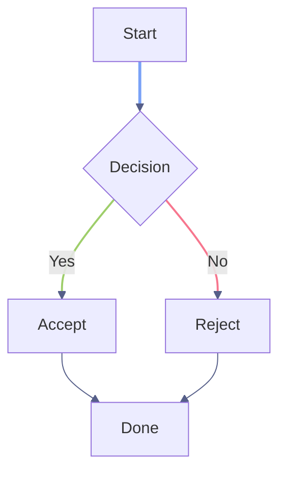

## Flowchart - Styled Links 2

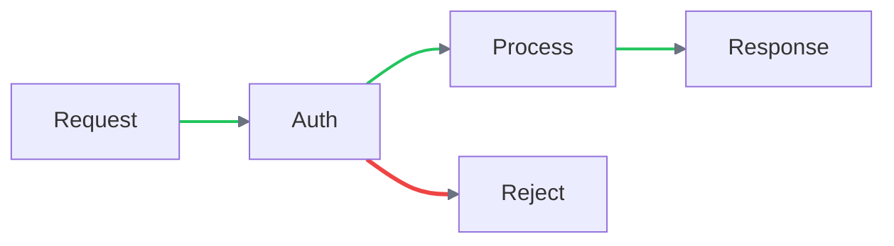

## Flowchart - Left to Right

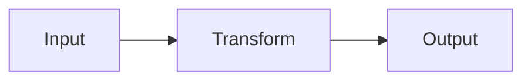

## Flowchart - Bottom to Top

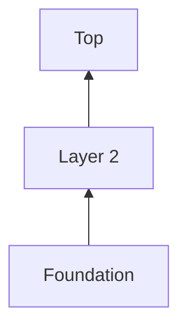

## Flowchart - Subgraphs

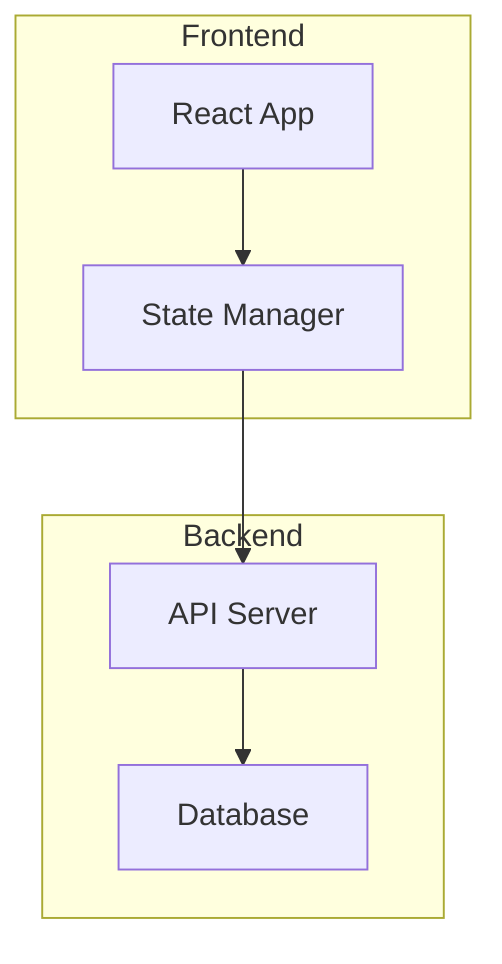

## Flowchart - Nested Subgraphs

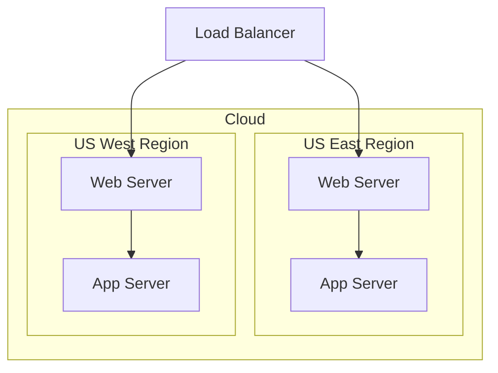

## Flowchart - Pipeline Subgraph

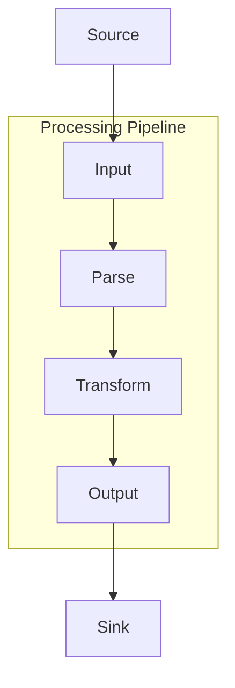

## Flowchart - Class Definitions

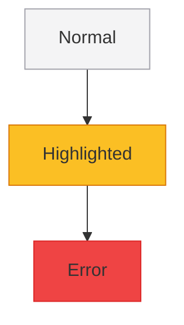

## Flowchart - Individual Styles

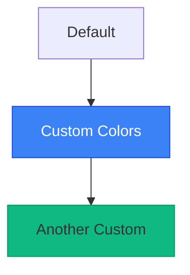

## Flowchart - CI Pipeline

```mermaid
graph TD
  subgraph ci [CI Pipeline]
    A[Push Code] --> B{Tests Pass?}
    B -->|Yes| C[Build Image]
    B -->|No| D[Fix & Retry]
    D -.-> A
  end
  C --> E([Deploy Staging])
  E --> F{QA Approved?}
  F -->|Yes| G((Production))
  F -->|No| D
```

## Flowchart - Microservices

```mermaid
graph LR
  subgraph clients [Client Layer]
    A([Web App]) --> B[API Gateway]
    C([Mobile App]) --> B
  end
  subgraph services [Service Layer]
    B --> D[Auth Service]
    B --> E[User Service]
    B --> F[Order Service]
  end
  subgraph data [Data Layer]
    D --> G[(Auth DB)]
    E --> H[(User DB)]
    F --> I[(Order DB)]
    F --> J([Message Queue])
  end
```

## Flowchart - Decision Tree

```mermaid
graph TD
  A{Is it raining?} -->|Yes| B{Have umbrella?}
  A -->|No| C([Go outside])
  B -->|Yes| D([Go with umbrella])
  B -->|No| E{Is it heavy?}
  E -->|Yes| F([Stay inside])
  E -->|No| G([Run for it])
```

## Flowchart - Git Branch

```mermaid
graph LR
  A[main] --> B[develop]
  B --> C[feature/auth]
  B --> D[feature/ui]
  C --> E{PR Review}
  D --> E
  E -->|approved| B
  B --> F[release/1.0]
  F --> G{Tests?}
  G -->|pass| A
  G -->|fail| F
```

## State Diagram - Basic

```mermaid
stateDiagram-v2
  [*] --> Idle
  Idle --> Active : start
  Active --> Idle : cancel
  Active --> Done : complete
  Done --> [*]
```

## State Diagram - Nested

```mermaid
stateDiagram-v2
  [*] --> Idle
  Idle --> Processing : submit
  state Processing {
    parse --> validate
    validate --> execute
  }
  Processing --> Complete : done
  Processing --> Error : fail
  Error --> Idle : retry
  Complete --> [*]
```

## State Diagram - Connection Lifecycle

```mermaid
stateDiagram-v2
  [*] --> Closed
  Closed --> Connecting : connect
  Connecting --> Connected : success
  Connecting --> Closed : timeout
  Connected --> Disconnecting : close
  Connected --> Reconnecting : error
  Reconnecting --> Connected : success
  Reconnecting --> Closed : max_retries
  Disconnecting --> Closed : done
  Closed --> [*]
```

## State Diagram - Unicode

```mermaid
stateDiagram-v2
  [*] --> 空闲
  空闲 --> 处理中 : 提交
  处理中 --> 完成 : 成功
  处理中 --> 错误 : 失败
  错误 --> 空闲 : 重试
  完成 --> [*]
```

## Sequence Diagram - Basic

```mermaid
sequenceDiagram
  Alice->>Bob: Hello Bob!
  Bob-->>Alice: Hi Alice!
```

## Sequence Diagram - Participants

```mermaid
sequenceDiagram
  participant A as Alice
  participant B as Bob
  participant C as Charlie
  A->>B: Hello
  B->>C: Forward
  C-->>A: Reply
```

## Sequence Diagram - Actors

```mermaid
sequenceDiagram
  actor U as User
  participant S as System
  participant DB as Database
  U->>S: Click button
  S->>DB: Query
  DB-->>S: Results
  S-->>U: Display
```

## Sequence Diagram - Arrow Types

```mermaid
sequenceDiagram
  A->>B: Solid arrow (sync)
  B-->>A: Dashed arrow (return)
  A-)B: Open arrow (async)
  B--)A: Open dashed arrow
```

## Sequence Diagram - Activation

```mermaid
sequenceDiagram
  participant C as Client
  participant S as Server
  C->>+S: Request
  S->>+S: Process
  S->>-S: Done
  S-->>-C: Response
```

## Sequence Diagram - Self Messages

```mermaid
sequenceDiagram
  participant S as Server
  S->>S: Internal process
  S->>S: Validate
  S-->>S: Log
```

## Sequence Diagram - Loops

```mermaid
sequenceDiagram
  participant C as Client
  participant S as Server
  C->>S: Connect
  loop Every 30s
    C->>S: Heartbeat
    S-->>C: Ack
  end
  C->>S: Disconnect
```

## Sequence Diagram - Alt

```mermaid
sequenceDiagram
  participant C as Client
  participant S as Server
  C->>S: Login
  alt Valid credentials
    S-->>C: 200 OK
  else Invalid
    S-->>C: 401 Unauthorized
  else Account locked
    S-->>C: 403 Forbidden
  end
```

## Sequence Diagram - Opt

```mermaid
sequenceDiagram
  participant A as App
  participant C as Cache
  participant DB as Database
  A->>C: Get data
  C-->>A: Cache miss
  opt Cache miss
    A->>DB: Query
    DB-->>A: Results
    A->>C: Store in cache
  end
```

## Sequence Diagram - Parallel

```mermaid
sequenceDiagram
  participant C as Client
  participant A as AuthService
  participant U as UserService
  participant O as OrderService
  C->>A: Authenticate
  par Fetch user data
    A->>U: Get profile
  and Fetch orders
    A->>O: Get orders
  end
  A-->>C: Combined response
```

## Sequence Diagram - Critical

```mermaid
sequenceDiagram
  participant A as App
  participant DB as Database
  A->>DB: BEGIN
  critical Transaction
    A->>DB: UPDATE accounts
    A->>DB: INSERT log
  end
  A->>DB: COMMIT
```

## Sequence Diagram - Notes

```mermaid
sequenceDiagram
  participant A as Alice
  participant B as Bob
  Note left of A: Alice prepares
  A->>B: Hello
  Note right of B: Bob thinks
  B-->>A: Reply
  Note over A,B: Conversation complete
```

## Sequence Diagram - OAuth Flow

```mermaid
sequenceDiagram
  actor U as User
  participant App as Client App
  participant Auth as Auth Server
  participant API as Resource API
  U->>App: Click Login
  App->>Auth: Authorization request
  Auth->>U: Login page
  U->>Auth: Credentials
  Auth-->>App: Authorization code
  App->>Auth: Exchange code for token
  Auth-->>App: Access token
  App->>API: Request + token
  API-->>App: Protected resource
  App-->>U: Display data
```

## Sequence Diagram - Bank Transfer

```mermaid
sequenceDiagram
  participant C as Client
  participant S as Server
  participant DB as Database
  C->>S: POST /transfer
  S->>DB: BEGIN
  S->>DB: Debit account A
  alt Success
    S->>DB: Credit account B
    S->>DB: INSERT audit_log
    S->>DB: COMMIT
    S-->>C: 200 OK
  else Insufficient funds
    S->>DB: ROLLBACK
    S-->>C: 400 Bad Request
  end
```

## Sequence Diagram - API Gateway

```mermaid
sequenceDiagram
  participant G as Gateway
  participant A as Auth
  participant U as Users
  participant O as Orders
  participant N as Notify
  G->>A: Validate token
  A-->>G: Valid
  par Fetch data
    G->>U: Get user
    U-->>G: User data
  and
    G->>O: Get orders
    O-->>G: Order list
  end
  G->>N: Send notification
  N-->>G: Queued
  Note over G: Aggregate response
```

## Sequence Diagram - Window Close

```mermaid
sequenceDiagram
  participant User
  participant Main as Main Process
  participant Renderer
  participant Timer as 3s Fallback Timer
  User->>Main: CMD+W
  Main->>Main: event.preventDefault()
  Main->>Renderer: WINDOW_CLOSE_REQUESTED
  Main->>Timer: Start 3s timer
  alt Multiple panels
    Renderer->>Renderer: closePanel(focusedId)
    Note over Renderer: Panel removed
    Note over Renderer: No confirmCloseWindow!
    Timer-->>Main: 3s elapsed → window.destroy()
  else Single panel
    Renderer->>Renderer: closePanel(lastId)
    Note over Renderer: Stack becomes []
    Renderer->>Renderer: Auto-select fires → new panel created!
    Note over Renderer: Panel reopens
    Timer-->>Main: 3s elapsed → window.destroy()
  end
```

## Class Diagram - Basic

```mermaid
classDiagram
  class Animal {
    +String name
    +int age
    +eat() void
    +sleep() void
  }
```

## Class Diagram - Visibility

```mermaid
classDiagram
  class User {
    +String name
    -String password
    #int internalId
    ~String packageField
    +login() bool
    -hashPassword() String
    #validate() void
    ~notify() void
  }
```

## Class Diagram - Interface

```mermaid
classDiagram
  class Serializable {
    <<interface>>
    +serialize() String
    +deserialize(data) void
  }
```

## Class Diagram - Abstract

```mermaid
classDiagram
  class Shape {
    <<abstract>>
    +String color
    +area() double
    +draw() void
  }
```

## Class Diagram - Enumeration

```mermaid
classDiagram
  class Status {
    <<enumeration>>
    ACTIVE
    INACTIVE
    PENDING
    DELETED
  }
```

## Class Diagram - Inheritance

```mermaid
classDiagram
  class Animal {
    +String name
    +eat() void
  }
  class Dog {
    +String breed
    +bark() void
  }
  class Cat {
    +bool isIndoor
    +meow() void
  }
  Animal <|-- Dog
  Animal <|-- Cat
```

## Class Diagram - Composition

```mermaid
classDiagram
  class Car {
    +String model
    +start() void
  }
  class Engine {
    +int horsepower
    +rev() void
  }
  Car *-- Engine
```

## Class Diagram - Aggregation

```mermaid
classDiagram
  class University {
    +String name
  }
  class Department {
    +String faculty
  }
  University o-- Department
```

## Class Diagram - Association

```mermaid
classDiagram
  class Customer {
    +String name
  }
  class Order {
    +int orderId
  }
  Customer --> Order
```

## Class Diagram - Dependency

```mermaid
classDiagram
  class Service {
    +process() void
  }
  class Repository {
    +find() Object
  }
  Service ..> Repository
```

## Class Diagram - Realization

```mermaid
classDiagram
  class Flyable {
    <<interface>>
    +fly() void
  }
  class Bird {
    +fly() void
    +sing() void
  }
  Bird ..|> Flyable
```

## Class Diagram - All Relationships

```mermaid
classDiagram
  A <|-- B : inheritance
  C *-- D : composition
  E o-- F : aggregation
  G --> H : association
  I ..> J : dependency
  K ..|> L : realization
```

## Class Diagram - Many-to-Many

```mermaid
classDiagram
  class Teacher {
    +String name
  }
  class Student {
    +String name
  }
  class Course {
    +String title
  }
  Teacher --> Course : teaches
  Student --> Course : enrolled in
```

## Class Diagram - Observer Pattern

```mermaid
classDiagram
  class Subject {
    <<interface>>
    +attach(Observer) void
    +detach(Observer) void
    +notify() void
  }
  class Observer {
    <<interface>>
    +update() void
  }
  class EventEmitter {
    -List~Observer~ observers
    +attach(Observer) void
    +detach(Observer) void
    +notify() void
  }
  class Logger {
    +update() void
  }
  class Alerter {
    +update() void
  }
  Subject <|.. EventEmitter
  Observer <|.. Logger
  Observer <|.. Alerter
  EventEmitter --> Observer
```

## Class Diagram - MVC

```mermaid
classDiagram
  class Model {
    -data Map
    +getData() Map
    +setData(key, val) void
    +notify() void
  }
  class View {
    -model Model
    +render() void
    +update() void
  }
  class Controller {
    -model Model
    -view View
    +handleInput(event) void
    +updateModel(data) void
  }
  Controller --> Model : updates
  Controller --> View : refreshes
  View --> Model : reads
  Model ..> View : notifies
```

## Class Diagram - Animal Hierarchy

```mermaid
classDiagram
  class Animal {
    <<abstract>>
    +String name
    +int age
    +eat() void
    +sleep() void
  }
  class Mammal {
    +bool warmBlooded
    +nurse() void
  }
  class Bird {
    +bool canFly
    +layEggs() void
  }
  class Dog {
    +String breed
    +bark() void
  }
  class Cat {
    +bool isIndoor
    +purr() void
  }
  class Parrot {
    +String vocabulary
    +speak() void
  }
  Animal <|-- Mammal
  Animal <|-- Bird
  Mammal <|-- Dog
  Mammal <|-- Cat
  Bird <|-- Parrot
```

## ER Diagram - Basic

```mermaid
erDiagram
  CUSTOMER ||--o{ ORDER : places
```

## ER Diagram - Attributes

```mermaid
erDiagram
  CUSTOMER {
    int id PK
    string name
    string email UK
    date created_at
  }
```

## ER Diagram - Foreign Keys

```mermaid
erDiagram
  ORDER {
    int id PK
    int customer_id FK
    string invoice_number UK
    decimal total
    date order_date
    string status
  }
```

## ER Diagram - One to One

```mermaid
erDiagram
  PERSON ||--|| PASSPORT : has
```

## ER Diagram - One to Many

```mermaid
erDiagram
  CUSTOMER ||--o{ ORDER : places
```

## ER Diagram - Optional to Many

```mermaid
erDiagram
  SUPERVISOR |o--|{ EMPLOYEE : manages
```

## ER Diagram - Many to Many

```mermaid
erDiagram
  TEACHER }|--o{ COURSE : teaches
```

## ER Diagram - All Cardinalities

```mermaid
erDiagram
  A ||--|| B : one-to-one
  C ||--o{ D : one-to-many
  E |o--|{ F : opt-to-many
  G }|--o{ H : many-to-many
```

## ER Diagram - Identifying

```mermaid
erDiagram
  ORDER ||--|{ LINE_ITEM : contains
```

## ER Diagram - Non-Identifying

```mermaid
erDiagram
  USER ||..o{ LOG_ENTRY : generates
  USER ||..o{ SESSION : opens
```

## ER Diagram - Mixed

```mermaid
erDiagram
  ORDER ||--|{ LINE_ITEM : contains
  ORDER ||..o{ SHIPMENT : ships-via
  PRODUCT ||--o{ LINE_ITEM : includes
  PRODUCT ||..o{ REVIEW : receives
```

## ER Diagram - E-Commerce

```mermaid
erDiagram
  CUSTOMER {
    int id PK
    string name
    string email UK
  }
  ORDER {
    int id PK
    date created
    int customer_id FK
  }
  PRODUCT {
    int id PK
    string name
    float price
  }
  LINE_ITEM {
    int id PK
    int order_id FK
    int product_id FK
    int quantity
  }
  CUSTOMER ||--o{ ORDER : places
  ORDER ||--|{ LINE_ITEM : contains
  PRODUCT ||--o{ LINE_ITEM : includes
```

## ER Diagram - Blog

```mermaid
erDiagram
  USER {
    int id PK
    string username UK
    string email UK
    date joined
  }
  POST {
    int id PK
    string title
    text content
    int author_id FK
    date published
  }
  COMMENT {
    int id PK
    text body
    int post_id FK
    int user_id FK
    date created
  }
  TAG {
    int id PK
    string name UK
  }
  USER ||--o{ POST : writes
  USER ||--o{ COMMENT : authors
  POST ||--o{ COMMENT : has
  POST }|--o{ TAG : tagged-with
```

## ER Diagram - School

```mermaid
erDiagram
  STUDENT {
    int id PK
    string name
    date dob
    string grade
  }
  TEACHER {
    int id PK
    string name
    string department
  }
  COURSE {
    int id PK
    string title
    int teacher_id FK
    int credits
  }
  ENROLLMENT {
    int id PK
    int student_id FK
    int course_id FK
    string semester
    float grade
  }
  TEACHER ||--o{ COURSE : teaches
  STUDENT ||--o{ ENROLLMENT : enrolled
  COURSE ||--o{ ENROLLMENT : has
```

## XY Chart - Bar

```mermaid
xychart-beta
    title "Product Sales"
    x-axis [Widgets, Gadgets, Gizmos, Doodads, Thingamajigs]
    bar [150, 230, 180, 95, 310]
```

## XY Chart - Line

```mermaid
xychart-beta
    title "Revenue Growth"
    x-axis [2018, 2019, 2020, 2021, 2022, 2023, 2024, 2025]
    line [320, 420, 540, 680, 820, 950, 1080, 1200]
```

## XY Chart - Bar + Line

```mermaid
xychart-beta
    title "Monthly Revenue"
    x-axis "Month" [Jan, Feb, Mar, Apr, May, Jun, Jul, Aug, Sep, Oct, Nov, Dec]
    y-axis "Revenue (USD)" 0 --> 10000
    bar [4200, 5000, 5800, 6200, 5500, 7000, 7800, 7200, 8400, 8100, 9000, 9200]
    line [4200, 5000, 5800, 6200, 5500, 7000, 7800, 7200, 8400, 8100, 9000, 9200]
```

## XY Chart - Horizontal

```mermaid
xychart-beta horizontal
    title "Language Popularity"
    x-axis [Python, JavaScript, Java, Go, Rust]
    bar [30, 25, 20, 12, 8]
```

## XY Chart - Multi Bar

```mermaid
xychart-beta
    title "2023 vs 2024 Sales"
    x-axis [Q1, Q2, Q3, Q4]
    bar [200, 250, 300, 280]
    bar [230, 280, 320, 350]
```

## XY Chart - Multi Line

```mermaid
xychart-beta
    title "Planned vs Actual"
    x-axis [Jan, Feb, Mar, Apr, May, Jun, Jul, Aug]
    line [100, 145, 190, 240, 280, 320, 360, 400]
    line [90, 130, 185, 235, 275, 340, 380, 420]
```

## XY Chart - Distribution Curve

```mermaid
xychart-beta
    title "Distribution Curve"
    x-axis 0 --> 100
    line [4, 7, 13, 21, 31, 43, 58, 71, 84, 91, 95, 91, 84, 71, 58, 43, 31, 21, 13, 7, 4]
```

## XY Chart - Monthly Active Users

```mermaid
xychart-beta
    title "Monthly Active Users (2024)"
    x-axis [Jan, Feb, Mar, Apr, May, Jun, Jul, Aug, Sep, Oct, Nov, Dec]
    y-axis "Users" 0 --> 30000
    bar [12000, 13500, 15200, 16800, 18500, 20100, 19800, 21500, 23000, 24200, 25800, 28000]
    line [12000, 13500, 15200, 16800, 18500, 20100, 19800, 21500, 23000, 24200, 25800, 28000]
```

## XY Chart - Horizontal Budget

```mermaid
xychart-beta horizontal
    title "Budget vs Actual"
    x-axis [Eng, Sales, Marketing, Product, Ops, HR, Finance, Legal]
    bar [500, 350, 250, 200, 150, 120, 100, 80]
    line [480, 380, 230, 180, 160, 110, 95, 75]
```

## XY Chart - Sprint Burndown

```mermaid
xychart-beta
    title "Sprint Burndown"
    x-axis [D1, D2, D3, D4, D5, D6, D7, D8, D9, D10]
    y-axis "Story Points" 0 --> 80
    line [72, 65, 58, 50, 45, 38, 30, 22, 12, 0]
    line [72, 65, 58, 50, 43, 36, 29, 22, 14, 0]
```
